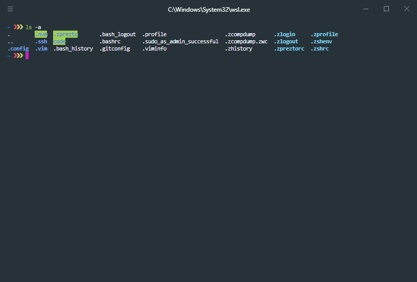

# Getting WSL Setup with Hyper + Zsh + Prezto

Documents the steps necessary to install a good terminal in Windows using the Windows Subsystem for Linux (WSL).  At the end, it should look like:



# WSL

Install the Windows Subsystem for Linux and the Linux distribution of choice.  In our case, we'll use Ubuntu provided by the Windows Store.

1.  Enable the "Windows Subsystem for Linux" feature:
    * Press the Windows key (`WIN`) and type "Turn Windows features on or off"
    * Find and enable "Windows Subsystem for Linux".
    * Restart your computer if prompted.
2.  Install Ubuntu
    * Press `WIN` and type "Ubuntu" (or go [here](https://www.microsoft.com/en-us/p/ubuntu/9nblggh4msv6)) and select the Windows Store option.
    * Provide a UNIX username (`'amsmith'`) and password during the installation steps.
    * Install the latest version(s) of the distro and of all dependencies:
    ```sh
    $ sudo apt-get update
    $ sudo apt-get upgrade
    $ sudo apt-get dist-upgrade
    $ sudo apt-get autoremove
    ```

If you run `ls -a`, you should see `.bash_logout`, `.bashrc`, and `.profile`.

If you wish to access this root path (`~`) in Windows, navigate to:
```sh
C:\Users\$WINDOWS_USER\AppData\Local\Packages\CanonicalGroupLimited.UbuntuonWindows_79rhkp1fndgsc\LocalState\rootfs\home\$UBUNTU_USER
```

# Zsh

Install [Zsh](https://github.com/zsh-users/zsh), a feature-rich shell with lots of features above and beyond the default shell.

1.  Install Zsh:
    ```sh
    $ sudo apt-get install zsh
    ```
2.  Step through first-time configuration and select the option which creates a blank `.zshrc` file:
    ```sh
    $ zsh
    ```
    > ...
    > <br>
    > (0)  Exit, creating the file ~/.zshrc containing just a comment.  That will prevent this function being run again.
    > <br>
    > ...
3.  Set `zsh` to be your preferred login shell:
    ```sh
    $ chsh -s $(which zsh)
    ```

If you exit and reload your terminal, it should load into Zsh.

# Prezto

Install [Prezto](https://github.com/sorin-ionescu/prezto), a configuration framework for Zsh that enriches the command line interface environment with defaults, aliases, functions, auto completion, and prompt themes.

1.  Install Prezto
    ```sh
    $ git clone --recursive https://github.com/sorin-ionescu/prezto.git "${ZDOTDIR:-$HOME}/.zprezto"
    ```
2.  Generate a new Zsh configuration by copying the files below:
    * First, delete the `.zshrc` file we generated above:
        ```sh
        $ rm -rf ~/.zshrc
        ```
    * And copy the preset configuration from Prezto:
        ```sh
        $ setopt EXTENDED_GLOB
        for rcfile in "${ZDOTDIR:-$HOME}"/.zprezto/runcoms/^README.md(.N); do
            ln -s "$rcfile" "${ZDOTDIR:-$HOME}/.${rcfile:t}"
        done
        ```
3.  Add some modules to your `.zpreztorc` config file:
    ```sh
    # Set the Prezto modules to load (browse modules).
    # The order matters.
    zstyle ':prezto:load' pmodule \
        'environment' \
        'terminal' \
        'editor' \
        'history' \
        'directory' \
        'spectrum' \
        'utility' \
        'completion' \
        'git' \
        'prompt' \
        'syntax-highlighting' \
        'history-substring-search'
    ```

If you exit and reload your terminal, it should load Prezto.

# Hyper

Install Hyper, an Eletron-powered terminal.

1.  Download and install [Windows.exe](https://hyper.is/).
2.  Open Hyper
3.  Navigate to, and open, Hyper's config file: `.hyper.js`
    ```sh
    $ cd /mnt/c/Users/$USERNAME/AppData/Roaming/Hyper
    $ vi .hyper.js
    ```
4.  Ensure Hyper is pointing to `wsl.exe`:
    ```js
    shell: 'C:\\Windows\\System32\\wsl.exe',
    ```
5.  Ensure Hyper launches in the WSL home (`~`).  By default, it launches in the Windows user directory:
    ```js
    shellArgs: ['~']
    ```
6.  If you exit and reload Hyper, you should now correctly load into Zsh at `~`.
7.  (Optional) Update keymaps as necessary.  For example:
    ```js
    keymaps: {
      "pane:splitVertical": ["ctrl+d"],
      "pane:splitHorizontal": ["ctrl+shift+d"],
      // "pane:close": ["ctrl+w"],
      "tab:new": ["ctrl+t"],

      "editor:copy": ["ctrl+shift+c"],
      "editor:paste": ["ctrl+shift+v"],
      "editor:selectAll": ["ctrl+shift+a"]
    },
    ```
    Note that `pane:close` is commented out.  As of this writing, that action crahes Hyper.  Instead, run `$ exit` to close a pane.
8.  (Optional) Open PowerShell and install the `hyper-material-theme` theme:
    ```sh
    > hyper install hyper-material-theme
    ```
8.  (Optional) Open PowerShell and install the `hyper-pane` plugin to enhance pane navigation:
    ```sh
    > hyper install hyper-pane
    ```

Exit and reload Hyper or do a hard reload (`ctrl+shift+r` by default).

# Install Node.js

Install Node.js.  Two possible paths are provided.

## nvm

Leveraging the Node Version Manager (nvm) makes this seamless and straight forward.

1.  Install nvm using the install script found [here](https://github.com/nvm-sh/nvm#install--update-script) and pipe it to `zsh`:
    ```sh
    $ curl -o- https://raw.githubusercontent.com/nvm-sh/nvm/v0.34.0/install.sh | zsh
    ```
2.  Remove the following line from `~/.zshrc`:
    ```sh
    [ -s "$NVM_DIR/bash_completion" ] && \. "$NVM_DIR/bash_completion"
    ```
    If you see the following error:
    > zsh compinit: insecure directories, run compaudit for list.
3.  Exit and reload your shell.
4.  Install the latest version of [Node.js](https://nodejs.org/en/):
    ```sh
    $ nvm install 12.7.0
    ```
5.  Ensure that both `node` and `npm` are available:
    ```sh
    $ node --version
    $ npm --version
    ```

## Volta

Volta is a viable alternative to nvm that simplifies version management for your tools.  Check it out at [volta.sh](http://volta.sh/):

1.  Install Volta:
    ```sh
    $ curl https://get.volta.sh | bash
    ```
2.  Install Node.js:
    ```sh
    $ volta install node
    ```
3.  Ensure that `node` is available:
    ```sh
    $ node --version
    ```

# GitHub

Follow the Linux steps outlined in GitHub's [Generating a new SSH key and adding it to the ssh-agent](https://help.github.com/en/articles/generating-a-new-ssh-key-and-adding-it-to-the-ssh-agent) guide.

# git

Git should already be installed.  You can verify this by running `$ git --version`.

If your git is out of date, you can upgrade it to the latest version:

```sh
$ sudo add-apt-repository ppa:git-core/ppa -y
$ sudo apt-get update
$ sudo apt-get install git -y
```

Add some reasonable aliases:

1.  Open `~/.gitconfig`.
2.  Add some reasonable aliases to improve your developer experience:
    ```
    [alias]
        alias = !git config --list | grep 'alias' | sort
        co = !git checkout $* && echo "Checked out:"
        st = !git status
        cp = !git cherry-pick
        p = !git fetch --tags --all && git pull --rebase
        pp = !git p && git push
        last = !git log -1 HEAD
        wipe = !git clean -xfd && git reset HEAD --hard
    ```

# Uninstall WSL

If for whatever reason you wish to uninstall the Windows Subsystem for Linux (WSL), simply open up Windows PowerShell and run the following command:

```sh
$ wslconfig.exe /u <DISTRIBUTION_NAME>
```

Where `<DISTRIBUTION_NAME>` matches an installed distro (e.g. `Ubuntu`).  If you are not sure which you have installed, use `/list /all`.